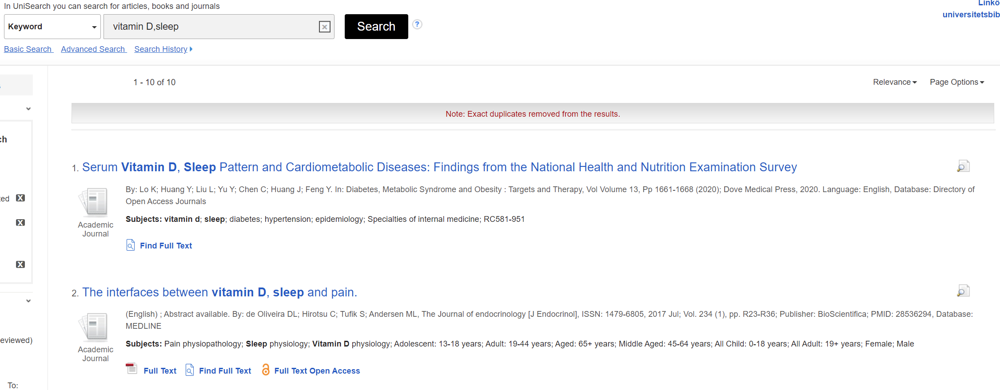

```{r setup, include=FALSE}
knitr::opts_chunk$set(echo = TRUE)
```
# Abstract
**ABSTRACT**:  In the context of higher education, searching for support material is always necessary for doing research and writing a paper. This paper will briefly introduce how search engines work. Then some basic strategies and search tools will be mentioned. This paper will also illustrate why those strategies would work by correlating to how search engines work.

## Introduce

The availability of scientific information is growing faster and faster[@edselc.2-52.0-8488350795920130101]. Although that means researchers and students have more choice, they need extra effort to locate their needed information from the growing scale of the database. Under such circumstances, advanced searching skills and strategies could be important and make the searching process more efficient.

A literature search is about searching several keywords and setting limitations in search engines and then finding related information. In this process, narrowing results will be applied several times.
Search engines collect the information and classify them by various standards. Once a command is received, they will search keywords in search engines and return feedback[@lkp.107661220150101].

## 1 Web crawler

Before diving into the topic of how search engines work, what is a web crawler should be mentioned. The information on the Internet is stored on countless servers. Any search engine that wants to answer the user’s search first needs to store the web page on its own local server, which depends on the web crawler [@S221478532035144020210101]. Crawlers send requests to various websites and store the returned pages. To find more websites, crawlers will visit available links in every found website. In this way, web engines will have access to all web pages on the internet.


## 2 How search engines work

Inverted list, a king of data structure, is widely applied in search engines. The inverted list will store words and their corresponding location just the same as the hash map[@wiki].When a word is fed into a search engine, the search engine will check the list and return a score of every possible website. After that, other factors like the latest updating date, popularity, and even business relationship will be considered as a part of the score[@featurescore]. Finally, the search engine would have a rank list and then present the result with this list.


From the sorting process, a conclusion can be extended: Higher ranking results are not necessarily more relevant to the topic. Because the score for each link is the sum of all the keywords’ scores (ignoring other factors), if particular keyword scores particularly high, it is likely that the link containing this keyword will be marked higher score. In picture1, the searching topic is “vitamin D benefit health”. The third link contains only vitamin D but scored higher than the fourth link, which is more relevant. 


## 3 Search skills and strategies

There are two important aspects of literature search, one is to pick the keywords, the other is to choose the search engine[@searchskill].

### 3.1 Narrow keywords

When choosing keywords, we usually choose words that can reflect the characteristics of the topic itself. However, in many cases, a topic will have many branch topics, which leads to the keyword search results are more likely to be relevant rather than helpful. In this case, the method of narrowing the scope of keywords should be adopted. For example, when searching for the topic “vitamin D benefits human health”, researchers may choose the keywords “vitamins” and “benefit health”.The picture below shows the result from the Liu library search system.


{width=70%}

As picture1 shows, the previous four pieces of literature are only relevant but do not hit the point. Therefore, refining the keywords is the strategy that should be adopted, and it is also helpful regarding sorting collected material. Divide the topic into several parts. Health consists of physical and mental health, and one of the standards of physical health is sleeping quality. So new keywords could be “vitamin ’’ and “sleep”. As shown in Figure 2, the second article is a wanted result. So researchers can combine all the results and form their conclusion about “how vitamin D benefits health”.

{width=70%}

### 3.2 Find appropriate search engine

Many search engines have their unique databases, and sometimes researchers need to search specific databases to get the information they need. In China, academic papers can be searched on “CnKI” or “Wanfang’’, daily life knowledge and daily news can be searched on “Baidu”, and information related to computer science can be searched on “CSDN”[@baidu]. For example, when researchers want some information about M1 chip, if they search “M1 chip” on “Baidu”, they will get advertisements from an online shop selling Apple computers in the first link whereas, in “CSDN”, they are more likely to get the parameters and analysis given by experts.

## 4 Conclusion
So far, this paper has mentioned the mechanism of search engines and also some strategies for modifying results. By narrowing keywords and choosing the appropriate search engines, we will get more relevant results. With the development of the internet and software technologies, it is strongly believed that more and more students will find it necessary to improve their search skills.


## Reference


